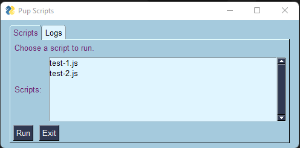
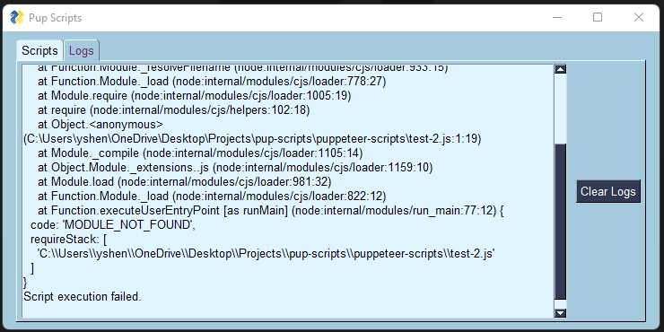

# PUP-SCRIPTS
A python gui that executes puppeteer scripts

## Demo

    
    

## Getting started
- Requirements: Puppeteer, PySimpleGui
- Add puppeteer scripts into the puppeteer-scripts folder
- Run the start.sh bash script or pup-scripts.py

## Features 
- Script selection
- Logs reading

## Technologies used
- PySimpleGui
- Puppeteer

